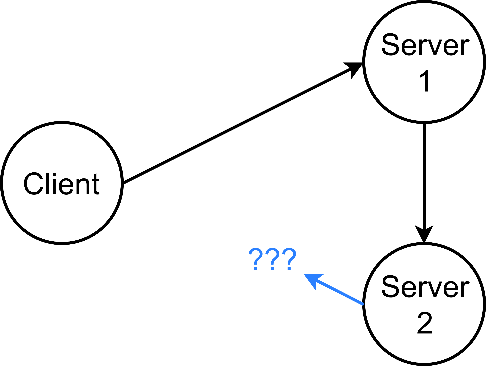
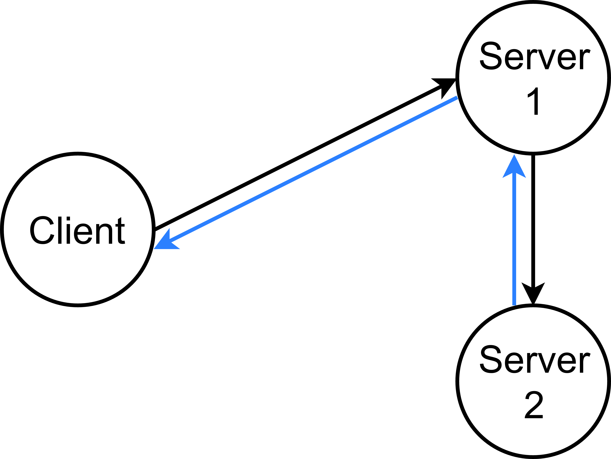
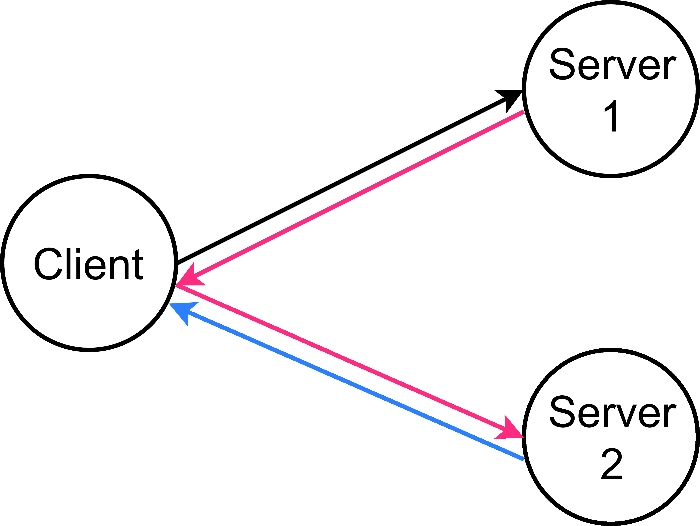
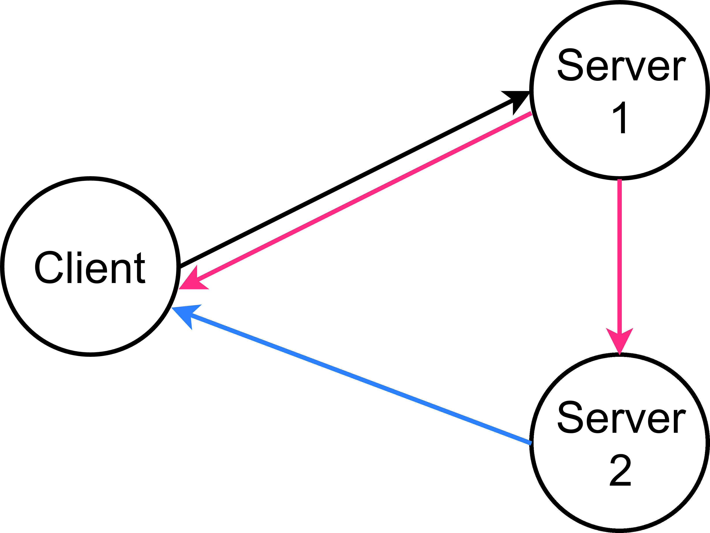

<!--===================================================================================-->

<section markdown="1" id="slides-cover">

What's Next for Cap'n Proto?

</section>

<!--===================================================================================-->

<section markdown="1" data-title="Streaming">

Cap'n Proto supports streaming!


interface FileStore {
  get @0 (name :Text, stream :Stream);
  put @1 (name :Text) -> (stream :Stream);
}

interface Stream {
  write @0 (data :Data);
  end @1 ();
}


But flow control is up to the app.

</section>

<!--===================================================================================-->

<section markdown="1" data-title="Flow Control">

Let's build it in.


interface Stream {
  write @0 (data :Data) -> bulk;
  end @1 ();
}


</section>

<!--===================================================================================-->

<section markdown="1" data-title="Realtime">

What about realtime streams?


interface VideoCallStream {
  sendFrame @0 (frame :Frame) -> realtime;
}


 Best served on a UDP transport...

</section>

<!--===================================================================================-->

<section markdown="1" data-title="Three-Party Handoff">

Forwarded request.

Where does response go?

</section>

<!--===================================================================================-->

<section markdown="1" data-title="Three-Party Handoff">

Classic solution:

Proxy

</section>

<!--===================================================================================-->

<section markdown="1" data-title="Three-Party Handoff">

Classic solution:

Redirect

</section>

<!--===================================================================================-->

<section markdown="1" data-title="Three-Party Handoff">

Cap'n Proto:

3-Party Handoff

(aka 3PH)

</section>

<!--===================================================================================-->

<section markdown="1" data-title="Three-Party Handoff">

Cap'n Proto:

3-Party Handoff

(aka 3PH)

... gonna need UDP

</section>

<!--===================================================================================-->

<section markdown="1" data-title="Three-Party Handoff">

Cap'n Proto:

3-Party Handoff

(aka 3PH)

... gonna need UDP

... and 0-RT crypto

</section>

<!--===================================================================================-->

<section markdown="1" data-title="Three-Party Handoff">

API: "Tail call"


kj::Promise<void> myRpc(MyRpcContext context) override {
  // Begin sub-request.
  auto subRequest = someCapability.someRpcRequest();
  subRequest.setSomeParam(someValue);

  // Send as a tail call.
  return context.tailCall(kj::mv(subRequest));
}


Today: Will proxy Future: 3PH

</section>

<!--===================================================================================-->

<section markdown="1" data-title="KJ TLS Bindings">

KJ client networking, no TLS:


void send() {
  auto io = kj::setupAsyncIo();
  auto& network = io.provider->getNetwork();
  auto addr = network.parseAddress("capnproto.org", 80)
      .wait(io.waitScope);
  auto connection = addr->connect().wait(io.waitScope);
  connection->write("GET /", 5).wait(io.waitScope);
}


</section>

<!--===================================================================================-->

<section markdown="1" data-title="KJ TLS Bindings">

KJ client networking with TLS:


void send() {
  auto io = kj::setupAsyncIo();
  kj::TlsContext tls;
  auto network = tls.wrapNetwork(io.provider->getNetwork());
  auto addr = network->parseAddress("capnproto.org", 443)
      .wait(io.waitScope);
  auto connection = addr->connect().wait(io.waitScope);
  connection->write("GET /", 5).wait(io.waitScope);
}


</section>

<!--===================================================================================-->

<section markdown="1" data-title="KJ TLS Bindings">

Diff:


void send() {

  kj::TlsContext tls;
                 tls.wrapNetwork(                         );

}


</section>

<!--===================================================================================-->

<section markdown="1" data-title="KJ TLS Bindings">


void receive() {
  auto io = kj::setupAsyncIo();
  auto& network = io.provider->getNetwork();
  auto addr = network.parseAddress("*", 80)
      .wait(io.waitScope);
  auto listener = addr->listen();
  auto connection = listener->accept().wait(io.waitScope);
  connection->write("HTTP/1.1 404 Not Found\r\n\r\n", 26)
      .wait(io.waitScope);
}


</section>

<!--===================================================================================-->

<section markdown="1" data-title="KJ TLS Bindings">


void receive() {
  auto io = kj::setupAsyncIo();
  kj::TlsKeypair keypair { KEY_PEM_TEXT, CERT_PEM_TEXT };
  kj::TlsContext::Options options;
  options.defaultKeypair = keypair;
  kj::TlsContext tls(options);
  auto& network = io.provider->getNetwork();
  auto addr = network.parseAddress("*", 443).wait(io.waitScope);
  auto listener = tls.wrapPort(addr->listen());
  auto connection = listener->accept().wait(io.waitScope);
  connection->write("HTTP/1.1 404 Not Found\r\n\r\n", 26)
      .wait(io.waitScope);
}


</section>

<!--===================================================================================-->

<section markdown="1" data-title="KJ TLS Bindings">


void receive() {

  kj::TlsKeypair keypair { KEY_PEM_TEXT, CERT_PEM_TEXT };
  kj::TlsContext::Options options;
  options.defaultKeypair = keypair;
  kj::TlsContext tls(options);

                  tls.wrapPort(              );

}


</section>

<!--===================================================================================-->

<section markdown="1" data-title="KJ HTTP Library">


auto io = kj::setupAsyncIo();
kj::HttpHeaderTable headerTable;
auto client = kj::newHttpClient(
    *headerTable, io.provider->getNetwork());

kj::HttpHeaders headers(*headerTable);
auto response = client->request(
    kj::HttpMethod::GET, "http://capnproto.org", headers)
    .response.wait(io.waitScope);

KJ_ASSERT(response.statusCode == 200);
KJ_LOG(INFO, response.body->readAllText().wait(io.waitScope));


</section>

<!--===================================================================================-->

<section markdown="1" data-title="KJ HTTP Library">

Headers identified by small numbers.


kj::HttpHeaderTable::Builder builder;
kj::HttpHeaderId userAgent = builder.add("User-Agent");
auto headerTable = builder.build();

kj::HttpHeaders headers(*headerTable);
headers.set(kj::HttpHeaderId::HOST, "capnproto.org");
headers.set(userAgent, "kj-http/0.6");


Header parsing is zero-copy.

</section>

<!--===================================================================================-->

<section markdown="1" data-title="Designated Initializers">

Ugly imperative code:


capnp::MallocMessageBuilder message;

auto root = message.initRoot<MyStruct>();
root.setFoo(123);
root.setBar("foo");
auto inner = root.initBaz();
inner.setQux(true);

capnp::writeMessageToFd(fd, message);


</section>

<!--===================================================================================-->

<section markdown="1" data-title="Designated Initializers">

Nice declarative code:


using namespace capnp::init;

capnp::MallocMessageBuilder message;
message.initRoot<MyStruct>(
  $foo = 123,
  $bar = "foo",
  $baz(
    $qux = true
  )
);
capnp::writeMessageToFd(fd, message);


</section>

<!--===================================================================================-->

<section markdown="1" data-title="Designated Initializers">

Even better:


using namespace capnp::init;

capnp::writeMessageToFd<MyStruct>(fd,
  $foo = 123,
  $bar = "foo",
  $baz(
    $qux = true
  )
);


</section>

<!--===================================================================================-->

<section markdown="1" data-title="Designated Initializers">


struct {
  template <typename T>
  struct Setter {
    T value;
    template <typename U> void operator()(U& target) {
      target.setFoo(kj::fwd<T>(value));
    }
  };

  template <typename T>
  Setter<T> operator=(T&& value) {
    return { kj::fwd<T>(value) };
  }
} $foo;


</section>

<!--===================================================================================-->

<section markdown="1" data-title="POCS">

Not idiomatic:


capnp::MallocMessageBuilder message;

MyStruct::Builder root = message.initRoot<MyStruct>();
root.setFoo(123);
root.setBar("foo");
InnerStruct::Builder inner = root.initBaz();
inner.setQux(true);

capnp::writeMessageToFd(fd, message);


</section>

<!--===================================================================================-->

<section markdown="1" data-title="POCS">

Plain Old C++ Structs?


MyStruct root;
root.foo = 123;
root.bar = "foo";
InnerStruct inner;
inner.qux = true;
root.baz = kj::mv(inner);

capnp::writeMessageToFd(fd, message);


Caveat: No longer zero-copy.

</section>

<!--===================================================================================-->

<section markdown="1" data-title="POCS">


capnp::MallocMessageBuilder message;
capnp::readMessageCopy(input, message);
auto root = message.getRoot<MyStruct>();
auto oldListOrphan = root.disownStructList();
auto oldList = oldListOrphan.getReader();
auto newList = root.initStructList(oldList.size() - 1);
for (auto i: kj::indices(newList)) {
  newList.setWithCaveats(i,
      oldList[i < indexToRemove ? i : i + 1]);
}
capnp::MallocMessageBuilder message2;
message2.setRoot(root.asReader());
capnp::writeMessage(output, message2);


</section>

<!--===================================================================================-->

<section markdown="1" data-title="POCS">


auto root = capnp::readMessageCopy<MyStruct>(input);
root.structList.erase(indexToRemove);
capnp::writeMessageCopy(output, root);


</section>

<!--===================================================================================-->

<section markdown="1" data-title="JSON-HTTP Bridge">


interface AddressBook {
  getPerson @0 (id :UInt32 $httpPath)
            -> (person :Person $httpBody(type = json))
      $http(method = get, route = "person");
  # GET /person/<id>
  # JSON response body

  updatePerson @1 (id :UInt32 $httpPath,
                   person :Person $httpBody(type = json));
      $http(method = put, route = "person");
  # PUT /person/<id>
  # JSON request body
}


</section>

<!--===================================================================================-->

<section markdown="1" data-title="JSON-HTTP Bridge">


addPerson @2 (person :Person $httpBody(type = json))
          -> (id :UInt32 $httpBody(type = jsonField));
    $http(method = post, route = "person");
# POST /person
# JSON request body
# JSON response body (object containing field `id`)

getAll @3 (page :UInt32 = 0 $httpQuery)
       -> (people: List(Person) $httpBody(type = json));
    $http(method = get);
# GET /?page=<num>
# Query is optional.
# JSAN (JSON array) repsonse body.


</section>

<!--===================================================================================-->

<section markdown="1" data-title="JSON-HTTP Bridge">


interface AddressBookService {
  getAddressBook @0 (key :String $httpPath)
                 -> (result :AddressBook $httpPipeline);
      $http(route = "book");
  # GET /book/JrpmUduyHd8uW3x3TOXn2g/person/123
  # Becomes:
  #     service.getAddressBook("JrpmUduyHd8uW3x3TOXn2g").send()
  #            .getResult().getPerson(123).send()
  #
  # GET /book/JrpmUduyHd8uW3x3TOXn2g
  # Becomes:
  #     service.getAddressBook("JrpmUduyHd8uW3x3TOXn2g").send()
  #            .getResult().getAll().send()
}


</section>

<!--===================================================================================-->

<section markdown="1" id="slides-cover">

Questions?

</section>
